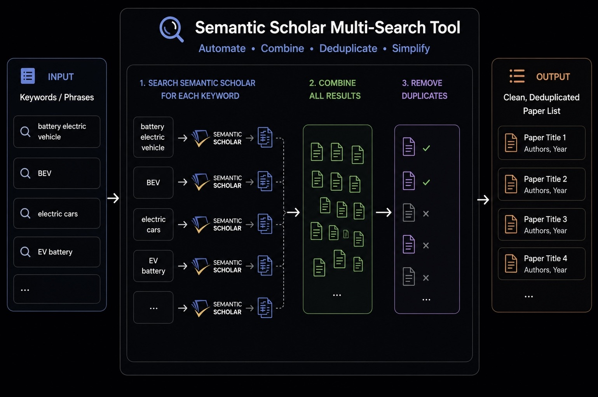

## Context

Semantic Scholar is an open-access academic search engine developed by the Allen Institute for AI. 
It helps researchers discover relevant papers and explore citations.

## Problem

Searching for scientific papers often requires trying multiple keywords or phrases. Doing this manually results in overlapping results and unnecessary duplicate papers.

## Solution

This tool automates the process by:
- Searching Semantic Scholar for each keyword
- Combining all results
- Removing duplicate papers
- Returning a single, clean list for further review



## Web

Visit: [https://your-website.com](https://your-website.com)

Enter your keywords and download the merged results.

## CLI

```bash
ssm search \
  --keywords "battery electric vehicle" \
  --keywords "hybrid electric vehicle" \
```

Example output:

```
- Found 178 unique papers:
- Saved papers in search_results.json and search_results.csv  
```

## Publication

This tool was developed as part of the methodology used in the following publication:

> **Methodology for AI-Based Search Strategy of Scientific Papers: Exemplary Search for Hybrid and Battery Electric Vehicles in the Semantic Scholar Database**
